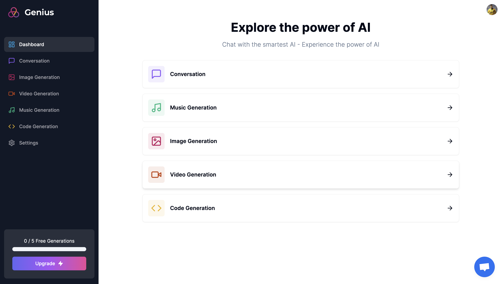

# Genius AI

Genius AI is a multipurpose AI SaaS tool. It comes with chat, text-to-image, text-to-video, and more! 

Note: if it is hosted on vercel on a hobby plan. The API requests for video, audio, etc. will time out.

## Installation
- Clone Genius AI into a folder on your local machine
- Inside of the Genius AI folder, run ```npm install```
- Once installations are done, run ```npm run dev```
- Enjoy!

## Gallery

### Dashboard


### Image Generation
